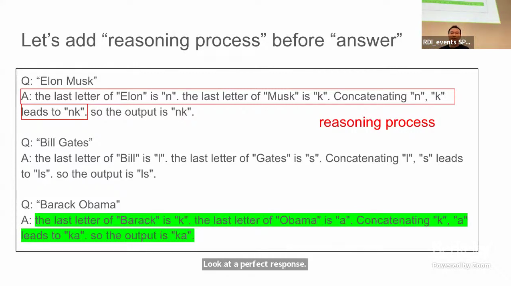
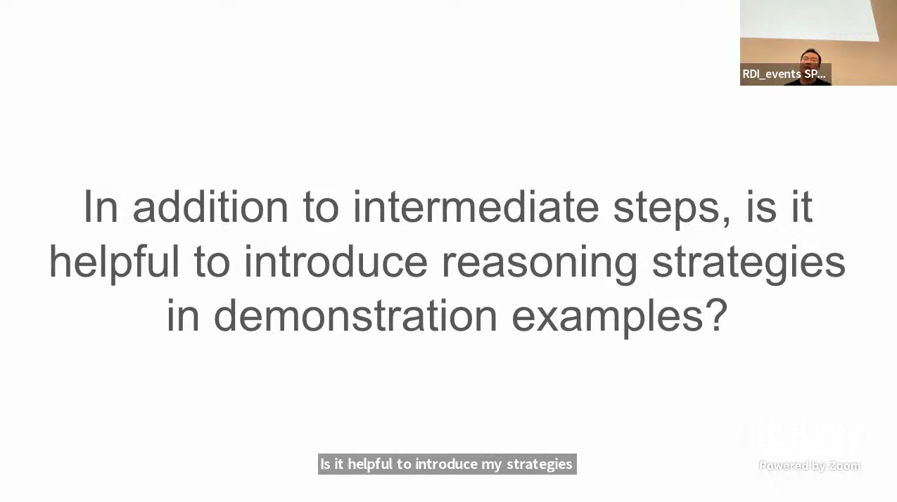
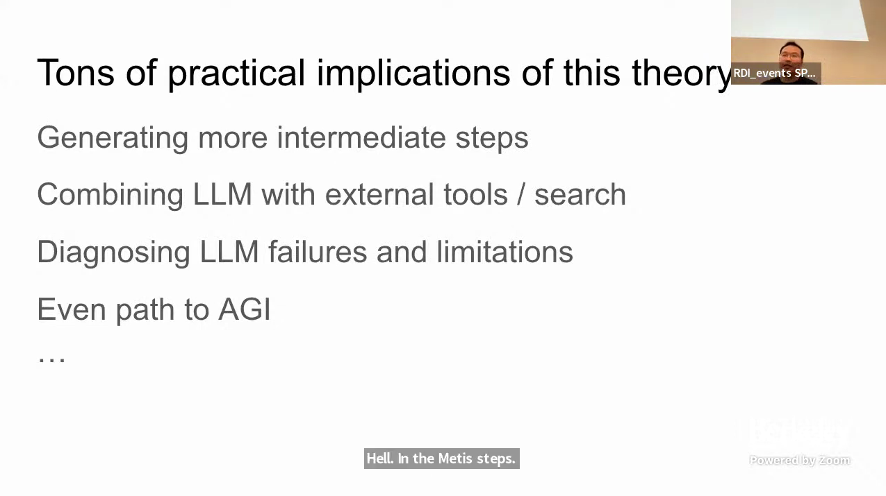
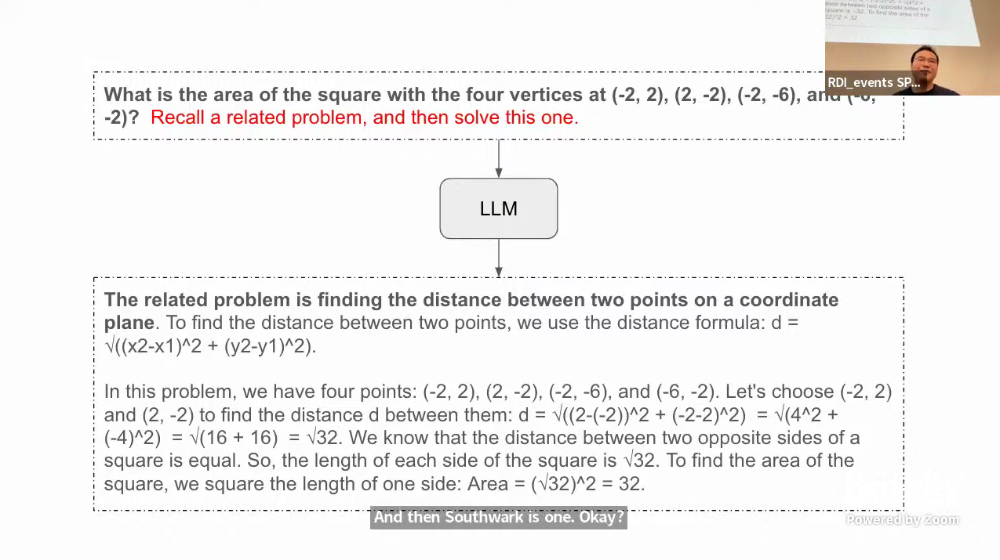

**Dawn Song [00:00.390]:**
Okay, thank you. I will start with some introduction and then we'll get into the actual contents of this class.

**Dawn Song [00:15.743]:**
My name is Dawn Song. I'm a professor in computer science here at UC Berkeley and also a co-director of the campus-wide Center on Responsible Decentralized Intelligence. I'm the instructor for this class, and we have a guest co-instructor, Xin Yun Chen from Google, who is also a Berkeley alum and my former student. We also have our great TAs, Alex and Sihun, and our readers, Tara and Aishun. This is the teaching staff who will be working together with you this semester.

**Dawn Song [01:02.415]:**
Everyone has been seeing the exciting growth of large language models. The speed of advancements is just astonishing. However, these large language models operate in a very simple manner: they take text inputs and produce text outputs. What we will cover in this class is the next frontier: large language model agents.

**Dawn Song [01:32.511]:**
Instead of just taking text as inputs and producing text as outputs, we use a large language model as the key framework for reasoning and planning for the agents and enable them to interact with external environments. These agents observe the environment and take actions within it. They will be using external tools, databases, and knowledge bases for retrieval to help perform these tasks.

**Dawn Song [02:13.028]:**
The rich capabilities of these large language models make LLM agents very flexible, allowing them to operate in diverse environments without much specific training. These LLM agents can interact with different types of environments, including surfing the web through various APIs online. They can also be integrated into robots, operating in the physical world. They can sense environments through different types of inputs, even in multi-modal settings, including sensory inputs, and take actions in these diverse environments. Through interaction with complex and diverse environments, they can update their memory, learn to use tools, interact with humans, and obtain grounding.

These agents not only interact with environments but also with other agents through multi-agent interactions and collaboration, including humans as well.

**Dawn Song [03:45.646]:**
This multi-agent collaboration can help agents collectively solve even more complex tasks.

**Dawn Song [03:56.332]:**
Why are LLM agents the next frontier? Why do we need to empower LLMs with the agent framework? There are several reasons. Solving real-world tasks is never just a single-step process with text inputs and outputs. It often involves a trial and error process. Leveraging external tools and retrieving information from external knowledge bases can help expand LLM's capabilities. More importantly, this dynamic agent workflow can facilitate solving complex tasks by enabling task decomposition, allocation of sub-tasks to specialized modules, and division of labor for project collaboration. Throughout the course, we also see that multi-agent interaction can help inspire better responses.

**Dawn Song [04:57.591]:**
Even though LLM Agents have been a fairly recent development, we have already seen them helping transform different application domains across a wide range, including education, law,

**Dawn Song [05:14.056]:**
finance, healthcare, cybersecurity, and more.

**Dawn Song [05:19.219]:**
The development is really exciting and is rapidly improving.

**Dawn Song [05:23.422]:**
There are many different leaderboards for various agent benchmarks available online, and you can observe rapid improvements across all these agent frameworks. To better enable agent deployments, we still need to address several key challenges.

**Dawn Song [05:44.480]:**
First, we need to improve the reasoning and planning capabilities of agents. LLM agents tend to make mistakes when performing complex tasks end-to-end, so enhancing these capabilities is crucial. We also need to improve embodiment and learning from environment feedback for these LLM agents. They are still not efficient at recovering from mistakes in long-horizon tasks, so we need to further develop methods and capabilities for continuous learning and self-improvement. Additionally, we must enhance multi-modal understanding, grounding, and world-model capabilities of these agents. As mentioned earlier, multi-agent systems can provide better solutions for tasks, and developing theory of mind helps improve multi-agent interactions. Safety and privacy issues are also very important for agents. LLMs are susceptible to adversarial attacks, can emit harmful messages, or leak private data. Solving these challenges is crucial for deploying LLM agents safely in the real world. Lastly, enabling effective human-agent interactions and addressing ethical concerns are essential. We need to develop methods to control agent behaviors and design interaction modes between humans and agents that best serve human needs.

**Dawn Song [07:38.462]:**
To help students learn and develop methods to address these challenges, the course has been designed to cover a broad spectrum of topics across different layers of the agent framework and various domains. We'll cover key model capabilities, including reasoning, planning, and multi-modal understanding. We'll also explore popular real-world agent frameworks to enable students to better design agent applications and use various agentic flows easily. This will help students learn to use agent frameworks for workflow design, implement retrieval-augmented generation (RAG), and work with multi-agent systems. We'll cover several exciting application domains using these agents, including software code development, workflow automation, multi-modal applications, and enterprise applications. Finally, we'll address important topics on agent safety and ethics. To cover these wide-ranging topics, we have assembled an amazing team of guest speakers.

**Dawn Song [09:07.589]:**
And researchers to cover these topics. So the class will be led by me and Xinyun, and we have this amazing crew of guest speakers to help cover these important topics in class.

**Denny Zhou [09:26.684]:**
Before I talk, I want to ask one question for everyone. So what do you expect AI to achieve? Let's take a few seconds to think about it. I can imagine many different answers, like solving the hardest math problems that humans cannot solve.

**Denny Zhou [09:55.118]:**
For example, even solve the Riemann hypothesis, right? Or discover new scientific theories, or even solve AGI.

**Denny Zhou [10:11.195]:**
My background is in machine learning. I don't know if many people study machine learning codes nowadays, because it's like "transformer is all we need," right? As a machine learning person, I have a little perspective about AI. AI should be able to learn from just a few examples, like what humans usually do. In the past decades, the machine learning community spent great efforts to develop data-efficient methods, like transfer learning, active learning, and computational sensing.

**Denny Zhou [10:59.182]:**
And, you know, if you look at papers in the past decade, people were always excited about one or two percentage point gains. So in practice, I actually never saw data-efficient approaches succeed.

**Denny Zhou [11:16.430]:**
I would like to say, miss and fail. Don't feel bad about it. I'm the person who should feel bad. I started machine learning over 20 years ago. The opposite of failure, actually, would lead me to think about a different problem. What's missing emotionally?

**Denny Zhou [11:43.672]:**
So I sort of tried for years. And finally, I found out the answer.

**Denny Zhou [11:51.018]:**
Reason. Nowadays, particularly for people in this course today, the answer seems so obvious, right? This lecture is about reasoning. Humans can learn from just a few examples because humans can reason, not because of data statistics.

**Denny Zhou [12:15.915]:**
Sounds so straightforward. Let's start from a toy problem.

**Denny Zhou [12:24.481]:**
In my research, I usually prefer a very simple problem, but one that contains all the challenging aspects. So this problem is called last-letter concatenation.

**Denny Zhou [12:39.250]:**
If you are familiar with neural symbolic literature, you'll find similar problems. For this problem, given a person's name as input, the output will be the concatenation of the first or the last letter of the first name and last name. For example, with Elon Musk, the last letter of Elon is N, the last letter of Musk is K. So the output is NK. It's very simple.

**Denny Zhou [13:22.242]:**
A few years ago, you would probably try to solve this with a machine learning model. For example, you could use a transformer model with an encoder and a decoder. You would find that you need plenty of labeled examples to train the model. Finally, you might get an accuracy of 85% or 90% or so. It's interesting to think about machine learning methods for such a simple task - simple for humans, that is. If the method requires a vast amount of labeled data to run, would you call it AI? AI means artificial intelligence, right? I suppose an intelligent model should be able to learn this task using just one or two examples. Now let's see how this problem can be solved using large language models.

**Denny Zhou [14:41.249]:**
I suppose most people know about large language models, but Professor Zhang told me not to assume that. LLMs are transformer models trained to predict the next word. For example, given the text "AI is the future," we mask "future," use "AI is the" as the input, and let the model predict what will be the next word. If the prediction is not the word "future," we need to adjust parameters to make the prediction correct. In machine learning, that's called backpropagation. Of course, you can train your model with many sentences. For example, you can use all text from the internet.

**Denny Zhou [15:45.393]:**
If you don't want to go into details, you can simply think of training LLMs as training parrots who mimic human language. Actually, I tweeted this sentence, and one guy who contacted me said he was very curious about training parrots. He was looking for a job.

**Denny Zhou [16:13.372]:**
Why should we change this model? We can mimic the training process, which is about creating a program. We can use any input to see what the output will be. The model creates that program, and then you can import the generated program, use it as input, and create the next program. That's how we can answer from LLMs. For this problem, we can simply concatenate all the examples we have as input, along with the test example, Barack Obama. We can try this using any LLM and see what happens. The problem you can see here is that it outputs CK. Of course, it's not correct, right? Because K is the last letter of Barack, and A is the last letter of Obama, the output should be AK. So it's wrong.

**Denny Zhou [17:23.016]:**
This is called a few-shot problem. It's just a mimic of a machine learning process. Instead of training a model, we just use the examples as input. That's the only difference. In the early days, when no one knew how to fix this problem,

**Denny Zhou [17:44.861]:**
this prompting idea emerged. We just need to add a reasoning process before the answer. Like, we just add the explicit process here: "The last letter of Obama is A, the last letter of Barack is K, concatenated AK." This is called a reasoning process. And similarly for Bill Gates. Now with this as the new input, we'll get a perfect response from the large language models.

**Denny Zhou [18:30.893]:**
So, even like humans, one demonstration is enough to get an accuracy of 100%.

**Denny Zhou [18:40.765]:**
That's exactly what I looked for. We cannot imagine any machine learning method achieving this perfect generalization here. There's no way. But by the way, don't underrate what I said about machine learning. Machine learning is super useful and important for doing any research. In the early days, I saw many naive mistakes from social media news, even from papers in local conferences. These naive mistakes mostly came from people who had no expertise in machine learning. They just randomly had different ideas. It's interesting, you know, this idea of adding intermediate steps has been

**Denny Zhou [19:37.383]:**
Many years ago, researchers proposed various approaches in the literature. An amazing paper, known by researchers, was published in ACO 2017. In their paper, they used natural language reasoning to solve math problems. The authors even derived the final answer through a series of small steps and trained a simple series model from scratch. If you're familiar with current work, you'd be surprised by this paper. The authors were like time travelers who knew how to make a different approach. In 2021, a team at OpenAI published an amazing dataset called GSM8K.

**Denny Zhou [20:52.444]:**
They followed the idea from the 2017 paper. In this dataset, every problem is followed by intermediate steps as a solution and also a final answer. This team created this amazing dataset and used it to fine-tune the GPT-3 model. They greatly scaled up the work from 2017 in just 14 months.

**Denny Zhou [21:31.812]:**
In the same year, 2021, a group of researchers at Google Brain, now part of DeepMind, published similar work titled "Show Your Work: Scratchpads for Intermediate Computation with Language Models." They discovered similar ideas independently but in the domain of program synthesis. That's why they used abstract symbols instead of natural language. In this context, many people know our work on chain-of-thought prompting. "Chain of thought" is not a term we invented; it's a common English phrase meaning multi-step reasoning.

**Denny Zhou [22:10.890]:**
In this work, we intensively evaluated prompting with individual steps and showed amazing results on almost every NLP task. Let's put all these papers together.

**Denny Zhou [22:40.763]:**
In 2017, researchers published a paper on training with intermediate steps. In 2021, papers were published on fine-tuning LLMs with intermediate steps. In 2021 and 2022, papers focused on prompting with intermediate steps. Obviously, it doesn't matter if you're using chain-of-thought, frontier, or prompt models. What really matters here?

**Denny Zhou [23:26.002]:**
Intermediate steps. That's the key. Let me summarize here.

**Denny Zhou [23:39.253]:**
Regardless of training, fine-tuning, or prompting, when provided with examples that include intermediate steps, LLMs will generate responses that also include intermediate steps.

**Denny Zhou [24:01.182]:**
Okay. Given intermediate steps, when I ask a question, is it helpful to introduce reasonable strategies in those examples? For humans, when they solve a problem, they could have a strategy for solving.

**Denny Zhou [24:27.153]:**
Here's work from our team, which I'm most proud of. In this work, we enable easy-to-use generalization by decomposition. Many people have seen this famous book, "How to Solve It," by Polya, a classic book for math education.

**Denny Zhou [24:52.269]:**
There's a chapter about decomposition. If you go into details, you may lose yourself. Now let's see what the difference is by decomposition.

**Denny Zhou [25:14.259]:**
Given this math problem here... By the way, the math in this talk is at an elementary level. Every time I give a talk, my daughter also gives me feedback. She's in fifth grade now. She said, "Yersin has three apples. Anna has two more apples than Yersin. How many apples do they have together?" Okay, we see the difference is that with decomposition, we first learn how to break down this problem into smaller problems and then solve them one by one. That's why I could list the problems from least to most complex. It's a very simple idea, but surprisingly effective.

**Denny Zhou [26:21.837]:**
So that's just like how humans decompose complex tasks into simpler tasks. This is a scan task for composition or generalization. You can look at examples here, given a natural language command, and we need to translate it to a sequence of actions that could be executed by robots. If you use zero-shot prompting, you'll get 99.7% accuracy. We just use 0.1% demonstration examples. I chose this task because I knew it from Xinwen, who's here today. She invented a beautiful approach to solve this task many years ago. When I looked at this task, I was really surprised, because it was so straightforward for humans. Why could it be so difficult for machines? Finally, we can solve it. And this is another task for the SAFER-CHILD technique.

**Denny Zhou [27:43.131]:**
Again, it's a compositional generalization task. I don't know if anyone knows the concept of compositional generalization. Roughly speaking, the task examples are more difficult than training examples or prompting examples. For instance, for code problems, we need a longer code snippet. Here, our approach changes a little bit; it's called dynamic least-most prompting. We just use one-person data and achieve results way better than the state-of-the-art results in the literature. The state-of-the-art results are actually achieved by specialized architecture design and training, and they use all the training data sets.

**Denny Zhou [28:50.046]:**
Any questions so far? Otherwise, I'll move on to the next section. Okay, I suppose this part is quite clear for everyone. I have two kids. My daughter is 10 years old, and my son is seven years old. Actually, when the ChatGPT founding paper came out, I overheard an interesting conversation between my daughter and my son. My daughter asked her little brother, "What's 17 times 3?" The little brother said, "I don't know." Then she asked, "What's 10 times 3?"

**Unknown [29:40.860]:**
30.

**Denny Zhou [29:40.921]:**
"What's 7 times 3?" "21." "So what's 17 times 3?" "Oh yeah, I know, 51!" The funny thing is, my daughter shouted to me, "Daddy, Qian is prompt-engineering her little brother's brain!" Now, one may ask why intermediate steps are helpful. It's natural for humans, but when doing research, we have to look deeper. We need to understand what's happening, just as we do with our machine learning models. This year, we have work published that will be presented at ICLR 2024, in collaboration with Braden Hancock from Stanford.

**Denny Zhou [30:42.748]:**
In that work, we provide a rigorous mathematical analysis. Here are the key results: A transformer generating intermediate steps can solve any inherently solvable problem, as long as its depth exceeds a constant threshold. I would emphasize again, constant. That means independent of your input. However, a transformer generating direct answers either requires a huge depth to solve or cannot solve at all. Please review these statements again before I move to the next slide. This probably has many practical implications.

**Denny Zhou [31:42.563]:**
If you couldn't solve a problem, you may think about generating more intermediate steps. You could also call some internal tools like search to help with intermediate steps. I studied this in an LLM agent course. Many people will talk about how to use it in the course. You can think about how to download LLM feeders and their limitations. One of my big interests is to find problems my daughter can solve in seconds, but LLMs fail. So far, we have talked about how to use examples to train LLMs to generate step-by-step reasoning.

**Denny Zhou [32:56.813]:**
It's possible to train reasoning without using examples. Here's an amazing work; when it came out, I thought it was a joke. It turned out not to be, and I was inspired a lot by this work.

**Denny Zhou [33:10.265]:**
It's called "Let's Think Step by Step." Given a question, we don't need any examples. We just need to say, "Let's Think Step by Step," and the model can generate reasoning steps.

**Denny Zhou [33:41.226]:**
It's really cool, but usually, the zero-shot approach, meaning no demonstrating examples, is worse than few-shot. So, one may wonder if we can have an approach that's still zero-shot but can do much better work.

**Denny Zhou [34:03.624]:**
This leads to another work on LLMs as analogical reasoners. There's a beautiful book, "How to Solve Math Problems."

**Denny Zhou [34:23.656]:**
It's a book that explains how to use analogical reasoning to solve math problems. When you see a new problem, you first ask yourself, "Do you know a related problem, methods, or strategies?" After my talk, you'll probably try to find this book and share it with others. I really like this quote from Banach.

**Denny Zhou [34:55.765]:**
If you've studied functional analysis, you'll know about Banach spaces. I was really amazed by that last sentence: "The ultimate mathematician is one who can see analogies between analogies." Of course, I showed you something here, but I don't know how far we are from AGI. Given this simple problem, we can see a different approach.

**Denny Zhou [35:32.531]:**
We call a related problem and then solve this one, okay. You can see that actually, we call these relevant examples and the knowledge is here, but those problems are exactly the same problem, yet they are useful. That's amazing. And we found that it works really well when we tried benchmarks.

**Denny Zhou [36:02.442]:**
So you can see that the last row is from an analogical reasoner by problem. Of course, you can optimize the prompts by yourself to get better results. The most important thing here is that it's much better than just the lessons step-by-step. Lessons step-by-step here means zero-shot. And even this approach outperforms manual zero-shot here. I think the main reason is that, you know, we use this approach, the model automatically generates related equations for each different problem.

**Denny Zhou [36:47.788]:**
These are results on Big Bench. Yeah. It was a great performance. And there is also what is compatible programming.

**Denny Zhou [37:04.217]:**
Yeah. If you are interested in compatible programming, you could try this approach. So what we didn't look at here is about scaling. You can even search the web for all related problems and knowledge for the problem you want to solve. So the key idea here is to generate relevant examples and knowledge for each given problem, instead of using a big set of examples as manual terms of prompting.

**Denny Zhou [37:41.192]:**
Okay, now we can see that we can use few-shot examples to show the model how to do step-by-step reasoning.

**Denny Zhou [37:51.138]:**
We also can do zero-shot without using any examples. Just see that simple step-by-step. Now we could ask another question. Is it possible to trigger step-by-step reasoning even without using any problem, that simple step-by-step? You could say, okay, what about models in Canada, are they just like that, right? You're right. What they did is fine-tuning or something. That means they already used many examples in the data mixture for training or tuning. So, yeah, we found the answer is yes.

**Denny Zhou [38:40.799]:**
It's in our recent work. Sort of reasoning without prompting. Without prompting, without saying anything, just give a problem to the model, even for a current trend, that is not a trend.

**Denny Zhou [38:58.270]:**
Let's look at an example. I have three apples, my dad has two more apples than me, and how many apples do we have together? For this example, the approach is very simple. At decoding, in the first step, we look at all possible tokens. Here, I've listed five tokens. We start with the first five tokens and then continue grid decoding. For the first one, I say five outputs. The first one is five, and the next one is five outputs. If you use code two, code cancel, it's "I," then the fourth generation will be, "I have three apples, my dad has two more apples than me, so we have five apples." That's correct. It's very interesting, right? We didn't see anything about reasoning here, but the model can do something if we start from different prompts. Here's another example: Was Nicholas Cage born in an even or odd year?

**Denny Zhou [40:32.506]:**
The first token is "Nicholas." For the second one, we have "even" and then a period. The third one is "odd" and then a period. If the model could have had a chain of thought in their response, they probably would have found it. We can use longer sentences, which means the model could do some reasoning steps. It's surprising to look at the probability of the final answer token. If you look at the probability on the first row here, "Nicholas Cage was born in an odd year," the probability is quite low. However, if you see a reasoning path like the last one, "Nicolas Cage was born in 1964, an even year," there's a reasoning process, and the probability jumps to 0.98. That's amazing, right? It seems that the model is so well calibrated. I was really surprised when I saw those probabilities. Even for "odd," the probabilities are very low. So, key observations:

**Denny Zhou [42:18.029]:**
Pre-trained language models have responses with step-by-step reasoning among the generations started with key tokens. We don't need to use any prompts here. There's higher confidence in decoding the final answer when a step-by-step reasoning path is present.

**Denny Zhou [42:49.094]:**
Here is a comparison between greedy decoding and chain-of-thought decoding. We see that the chain-of-thought decoding performs much better.

**Denny Zhou [43:03.449]:**
Yeah, so far any questions here? Now let's move to the next topic. Generating intermediate steps is really helpful, but are there any concerns about generating intermediate steps instead of direct answers?

**Denny Zhou [43:26.484]:**
Any concerns?

**Denny Zhou [43:35.137]:**
So, it probably depends on your problem and your needs. Actually, we need to always keep in mind

**Denny Zhou [44:01.229]:**
that LMs are probability models of generating next tokens. They are not humans, regardless of whether I use case examples or not. Keep this in mind. It's a probability model.

**Denny Zhou [44:24.067]:**
So what do LMs do? They decode. It's actually argmax probability of reasoning path and the final answer given the problem. However, what we want is argmax probability of the final answer given the problem, right?

**Denny Zhou [44:52.288]:**
That's what we learned in machine learning. This doesn't mean the reasoning path is not important. I'm just saying find the answer. We have to make sure the answer is correct and then look at the reasoning paths. They are not aligned, right? They're two different objectives. Now let's look one step further.

**Denny Zhou [45:25.731]:**
Okay. To compute the probability of finding the answer given the problem, we should sum over all possible reasoning paths. That's how to compute it from our course, right? Given a math problem, you could find different solutions that lead to the same answer. We need to do the summation here. And then, how to compute the sum? If you're studying machine learning, you'll know the answer here. It's simple. Now, this leads to our work on self-consistency.

**Denny Zhou [46:25.318]:**
Probably many people know about self-consistency, but my talk here is to help you see the underlying motivation, how we approach this problem from first principles in machine learning. So let's look at the question here.

**Denny Zhou [46:44.965]:**
Okay, given this math problem, we could sample the answer multiple times. The most frequent answer is 18. I want to give a warning here: we choose the most frequent answer, not the most frequently written paths. That's a huge difference. The written paths here are relatively viable. This idea is so simple; by using self-consistency, we simply crushed the state-of-the-art results in the literature at that time. When doing research, it's really just about the idea; you don't have to know a lot of things.

**Denny Zhou [47:54.602]:**
Of course, given our explanation on self-consistency, it's about probability and sampling. Imagine that more consistent results are more likely to be correct. When you look at the curves here, if the consistency is more than 80%, then the accuracy is nearly 100%.

**Denny Zhou [48:27.901]:**
So, when the LLM offers a direct answer without intermediate steps, we will sample several times and then choose the most common answer. Anyone like the answer here? Great. One token is already the token with maximum probability.

For the third question, change self-consistency by letting LLM generate multiple responses instead of sampling multiple times, and then choose the most common answer.

**Denny Zhou [49:32.861]:**
Does this make sense? Great. For both answers, we just need to follow this principle: find the answer with maximum probability given the problem. That's all you need to understand self-consistency. It's a very simple principle, one of the first principles in machine learning. If you don't know much better, it's also known as maximum marginal inference.

**Denny Zhou [50:12.192]:**
OK, so I want to talk about free-form answers. This idea is a little bit different from the relations I put here.

**Denny Zhou [50:34.166]:**
Given this problem, "Where do people drink less coffee than they do in Mexico?", you can look at the answers. Each answer is different from the others. But the most common response here is Japan, China, and India.

**Denny Zhou [51:00.089]:**
Any questions, otherwise I'll move to the next section: Self-consistency.

**Denny Zhou [51:12.460]:**
Oh, sample your answer multiple times and then choose the most frequent answer as the final output. Yeah. Next, I'm going to talk about limitations. The first one I want to discuss is how LLMs can be easily distracted by irrelevant context.

**Denny Zhou [51:48.660]:**
From psychology studies, we know that irrelevant information

**Denny Zhou [51:55.498]:**
may significantly decrease some children's and even adults' problem-solving accuracy. I want to check if this observation holds for LLMs.

**Denny Zhou [52:10.166]:**
So this is a simple problem here. The highlighted text is manually added. We saw that Mario's hourly rate is $10. This is already the problem, but I see after the model made it wrong. So what's interesting is that if we add a problem-relevant context,

**Denny Zhou [52:51.994]:**
the model immediately notices that and makes a correct answer. But it's still hard to take the correct path if we make the irrelevant context actually big.

**Denny Zhou [53:08.383]:**
So even if I simply just add irrelevant sentences like "the sky is blue and the grass is green" or something, you know, those nonsense, if you make this input actually long, you will see a significant performance drop across all LLMs. The next limitation I'm going to talk about is that LLMs cannot self-correct reasoning yet.

**Denny Zhou [53:42.107]:**
Let's start with a math problem again.

**Denny Zhou [53:46.788]:**
And actually, this problem is a little bit tricky to look at. You can see that the model gave a wrong answer. Then we prompted the model with, "Review your previous answer and find problems with your answer." Interestingly, after reviewing, the model recognized the mistake and corrected its answer. This looks like something amazing, right? Then we see another prompt: "Based on the problem you find, improve your answer." And the final answer here is correct. However, if the original answer is correct, with the same prompt,

**Denny Zhou [54:53.780]:**
the model could make a mistake. That's the problem. So overall, when allowing LLMs to review their generated responses, it can help correct inaccurate answers.

**Denny Zhou [55:13.085]:**
It may also risk changing correct answers into incorrect ones. We ran extensive studies

**Denny Zhou [55:23.288]:**
on some benchmarks, like GSMK, Coefficient QA, and HOTPOT QA. We didn't notice any improvements from self-correction methods. It just makes it worse. There were some reported improvements in the literature, but they used Oracle answers.

**Denny Zhou [55:54.423]:**
You can see the Oracle here. Oracle means you only prompt LMs to correct the answer when the answer is wrong. The problem is that the model doesn't know if the answer is correct or wrong. You tell them the answer is wrong, even when it's correct. We also explored multi-agent debate, where multiple LMs debate each other to achieve an agreement or consensus.

**Denny Zhou [56:35.682]:**
We tried an approach where we analyzed the number of responses generated. For example, with three LMs, if each generates a response, that's three. If we let them debate, that would be nine responses total. We compared this to self-consistency with nine responses. We found that these approaches cannot outperform self-consistency, which is a much simpler method that takes the most frequent answer. The lesson we learned is that Oracle feedback is needed for LMs to self-correct.

**Denny Zhou [57:29.384]:**
If so, then we add it to our work as self-depart.

**Denny Zhou [57:33.609]:**
Self-depart naturally leverages unit tests as Oracle. It's a part of the coding problems. You can use unit tests as ground truth. We started this work quite early, and we didn't make it that self-referential, and then finally we moved to the podium. Lastly, I want to talk about how premise order matters in LM reasoning.

**Denny Zhou [58:08.846]:**
In the early days, whenever we used to have referrals from archives or other sources, people would show great results.

**Denny Zhou [58:18.592]:**
For example, recently a model could be flashing and it should emit a result on a given key. I have problems with tracking numbers. In the past, the model would train with all data from the internet. There were really some other problems. So one of my team's tasks is to generate different evaluation tasks to test the models. Here, we just did a simple check. We are given this original TSMK problem. We reordered the sentences a little bit and see if the model can still solve it. In this problem, the original problem is that he lost 10 beers while getting home. We could just move this sentence to the end and see what happened. We made some changes for some of the key problems. We noticed that there was about a 10-point drop in solving these across all frontier areas.

**Denny Zhou [59:42.775]:**
You can compare responses for the problem with the original order and the reordered problem. We see that the model actually just knows how to solve the problem sequentially. It couldn't go back and forth.

**Denny Zhou [01:00:10.305]:**
One could say this would be related to some semantic understanding, what is bound reasoning. So we designed another task called logical inference. It's even more pure than math problems. Even when we don't use real words, we just use random tokens here. Given the rules and the facts, the model performs logical inference for the query. In the original problem, the rules are ordered according to their use in the inference process. I will point out that not all rules are necessary for the query. We could just randomly order those rules, only reordering rules relevant to the query. If not relevant to the query, they just keep their original positions. Surprisingly, we saw a significant drop in performance across all models. From my personal experience, I think it's really important to design experiments when doing research. This is just like a debacle.

**Denny Zhou [01:02:09.417]:**
Let me summarize the talk. First, generating intermediate steps significantly improves LLM's performance. You can achieve this through training, fine-tuning, prompting with intermediate steps, zero-shot analogical reasoning, or special decoding methods like CMT decoding, which I presented today. Additionally, self-consistency greatly improves step-by-step reasoning, regardless of whether you're using a fundamental or foundation model. I also discussed several limitations, including context sensitivity, lack of self-correction, and the impact of premise order on reasoning performance.

**Denny Zhou [01:03:10.889]:**
Now, you might wonder, what's next? What problem should we work on?

**Denny Zhou [01:03:25.619]:**
The most important suggestion is this: while it's tempting to say we should work on AGI or solve AGI, that's not the real problem. The challenge is to find the right problem to work on and to solve it from first principles, not just from existing principles. That last point is crucial.

**Denny Zhou [01:03:50.842]:**
On a related note, I'm coordinating a conference called the Conference on Language Modeling with a group of amazing people. It's the first-ever conference dedicated to language modeling, and you're all welcome to attend. That's all. Thank you.
